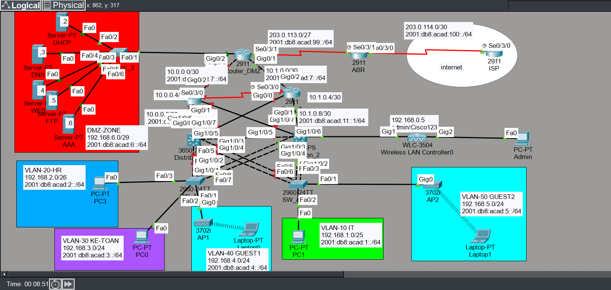
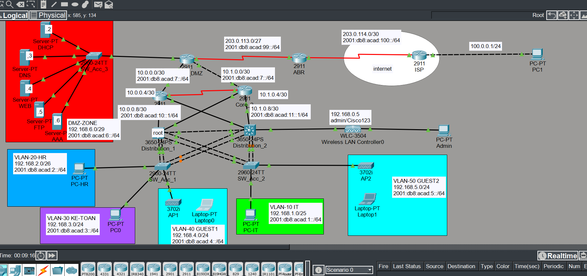

# Network Configuration Project

This project simulates a network topology for a corporate enterprise using a 3-layer model: Core, Distribution, and Access. It includes configuration of routing protocols, VLANs, inter-VLAN routing, and more.

## Network Devices Configured:
- **Core Routers**: Core_1, Core_2
- **Access Routers**: Router_DMZ
- **ISP Router**: ISP

## Project Features
- **OSPF Configuration** for dynamic routing
- **VLAN Configuration** for network segmentation
- **DHCP Setup** for automatic IP address assignment
- **Basic Security** using **ACLs**

## Folder Structure
- `configs/`: Contains all configuration files for routers and switches
- `images/`: Contains network topology diagrams

## How to Use
1. Clone the repository.
2. Load the configuration files on appropriate network devices.
3. Implement the setup and test the network.

## Network Topology

### Network Topology Diagram
This diagram shows the full enterprise network using a 3-tier architecture
(Core – Distribution – Access), including DMZ and ISP connectivity.

## Wireless Network

Enterprise wireless access is implemented using a WLC with AAA/PSK authentication.

📄 Detailed wireless configuration and design:
- [Wireless Design Documentation](docs/wireless_design.md)
