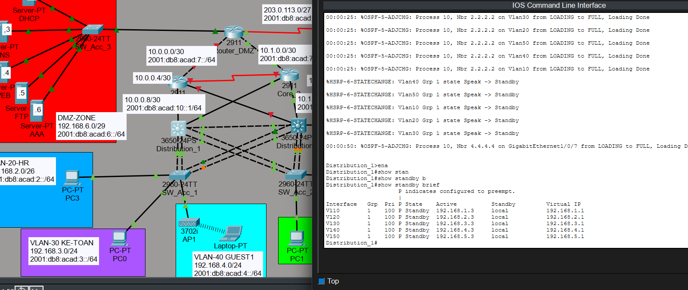
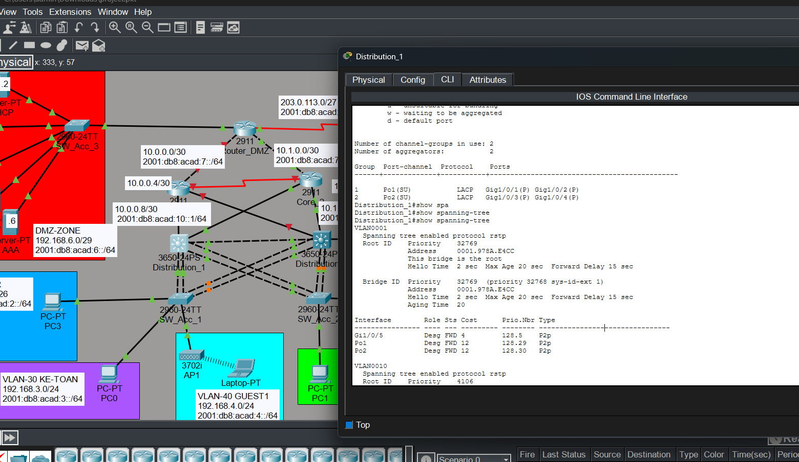
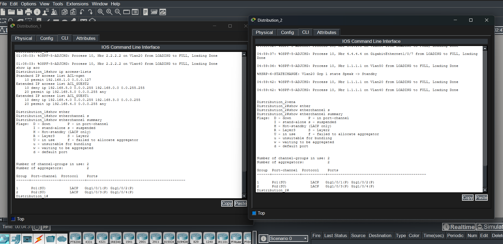

# High Availability & Layer 2 Redundancy Verification

This section verifies the implementation of high availability and redundancy
mechanisms at the distribution layer to ensure continuous network operation
in case of link or device failure.

---

## 🔁 HSRP – Default Gateway Redundancy

Hot Standby Router Protocol (HSRP) is configured on Distribution switches to
provide a resilient default gateway for end devices.

- One distribution switch operates as **Active**
- The other operates as **Standby**
- Automatic failover occurs if the active gateway becomes unavailable

HSRP state and virtual IP assignment were verified using CLI commands.

This ensures uninterrupted gateway availability for all VLANs.

---

## 🌳 Spanning Tree Protocol (RSTP)

Rapid Spanning Tree Protocol (RSTP) is enabled to prevent Layer 2 loops while
maintaining fast convergence.

- Distribution switches are configured with optimized bridge priorities
- Root bridge election is controlled for predictable traffic flow
- Access ports operate in forwarding state as expected

Spanning tree status and root bridge roles were verified.

---

## 🔗 EtherChannel (LACP)

EtherChannel using LACP is deployed between Distribution and Access switches
to increase bandwidth and provide link redundancy.

- Multiple physical links are bundled into logical port-channels
- Traffic load is balanced across member links
- Link failure does not impact overall connectivity

EtherChannel status and port-channel membership were verified.

---

These results confirm that HSRP, RSTP, and EtherChannel are correctly implemented
to provide a highly available and resilient enterprise network design.
