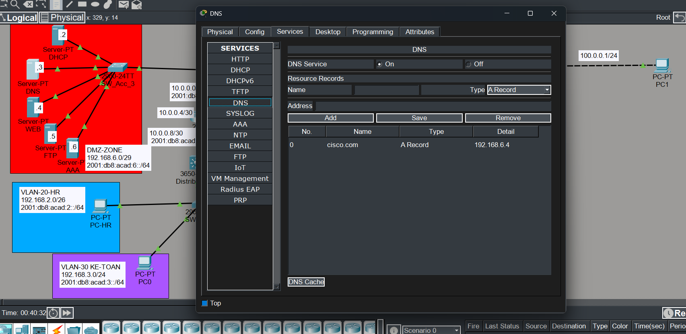
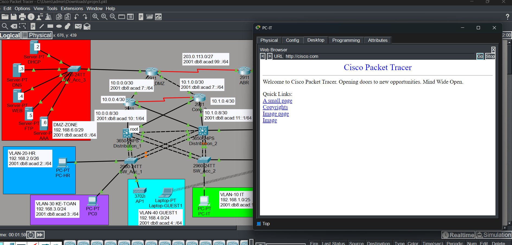
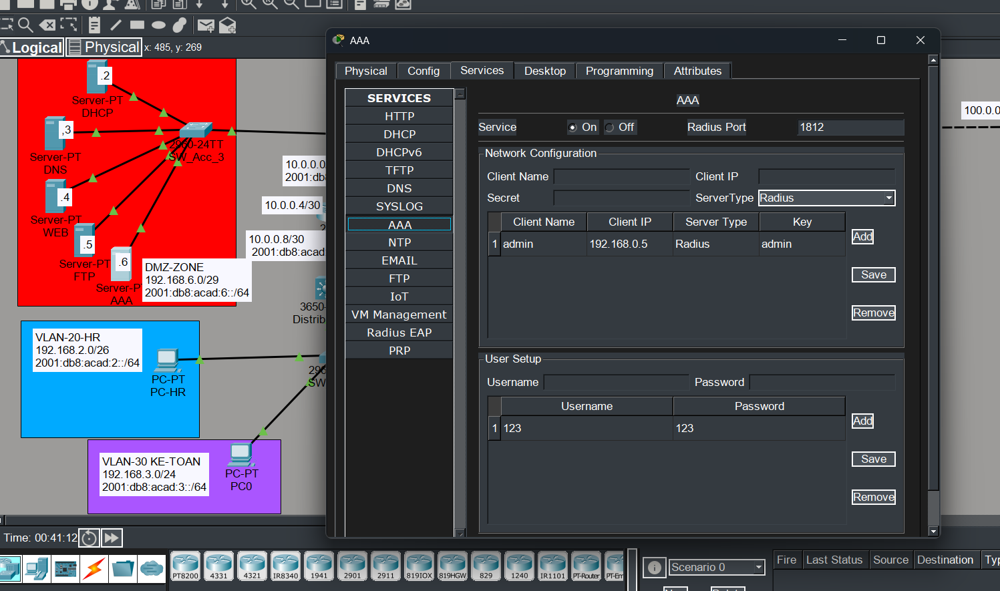

# Infrastructure Services Verification

This section verifies core infrastructure services deployed in the DMZ,
including DHCP, DNS, AAA (RADIUS), and Web services, which support both
wired and wireless enterprise users.

---

## 📦 DHCP Service Verification

The DHCP server located in the DMZ provides dynamic IP address assignment
to internal VLANs and wireless guest networks.

Verification confirms:
- Clients successfully obtain IPv4 addresses via DHCP
- Correct default gateway and DNS server information is assigned
- DHCP relay (ip helper-address) functions properly across VLANs

---

## 🌐 DNS Service Verification

The DNS server resolves internal domain names for enterprise users.

Verification confirms:
- DNS service is operational
- Internal domain name resolution is successful
- The domain **cisco.com** correctly resolves to the DMZ web server
  (192.168.6.4)

---

## 🌍 Web Service Access (DMZ)

The web server is deployed in the DMZ and published to internal and external
clients via static NAT.

Verification confirms:
- Internal clients can access the web service using DNS name resolution
- HTTP service responds correctly from the DMZ web server

---

## 🔐 AAA (RADIUS) Authentication Verification

An AAA server is deployed in the DMZ to provide centralized authentication
for secure wireless access (WPA2-Enterprise).

Verification confirms:
- RADIUS service is enabled and operational
- Wireless clients successfully authenticate using valid credentials
- Authentication requests are handled centrally by the AAA server

---

These results confirm that DHCP, DNS, Web, and AAA services are fully
operational and correctly integrated into the enterprise network design.
