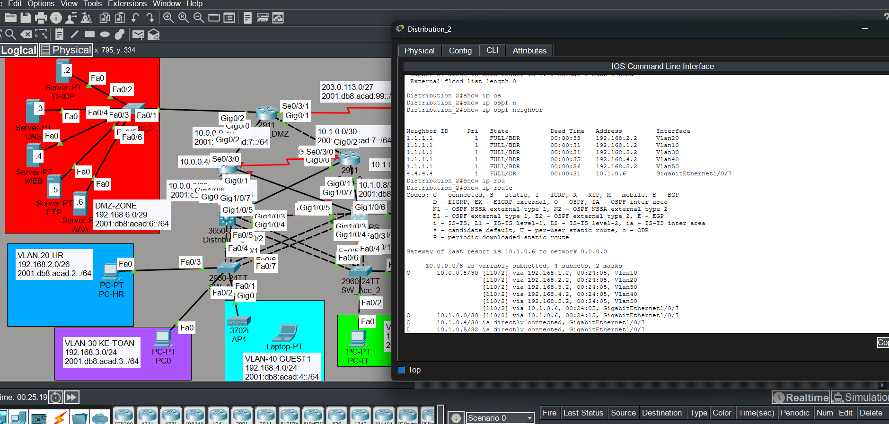
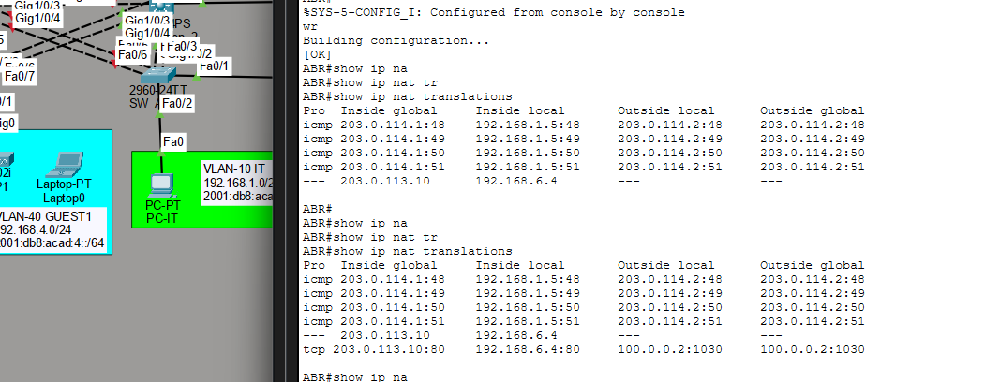

# Routing & NAT Verification

This section verifies dynamic routing and Internet connectivity across the
enterprise network, including OSPF neighbor relationships, routing tables,
and NAT translation behavior.

---

## 🔁 OSPF Routing Verification

Open Shortest Path First (OSPF) is deployed as the interior gateway protocol
to provide dynamic routing between the Core, Distribution, and DMZ routers,
enabling automatic scalability and fast convergence at the cost of higher
CPU and memory utilization compared to static routing.

Verification confirms:
- All OSPF neighbors are in the **FULL** state
- VLAN and point-to-point networks are successfully advertised
- Routing tables contain learned OSPF routes

This ensures full Layer 3 reachability across the enterprise network.

---

## 🌍 NAT & Internet Connectivity Verification

Network Address Translation (NAT) is configured on the ABR router to allow
internal networks to access external networks and the Internet.

Verification confirms:
- Inside local addresses are correctly translated to inside global addresses
- Dynamic NAT entries are created for outbound traffic
- Static NAT is configured to publish the DMZ web server (192.168.6.4) using the
  public IP address 203.0.113.10, ensuring that internal private IP addressing
  is not exposed to external networks.

NAT translation tables confirm correct bidirectional traffic flow between
internal networks, the DMZ, and external networks.

---

These results confirm that dynamic routing and Internet connectivity are
implemented correctly and operate according to enterprise network design
best practices.
