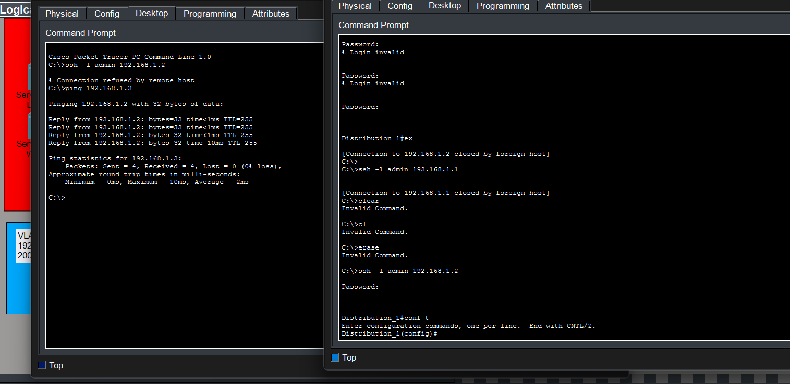
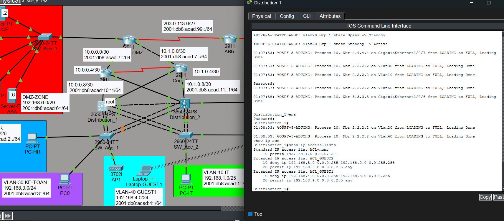
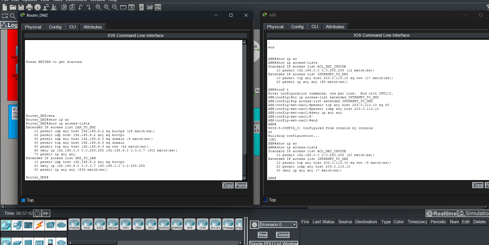
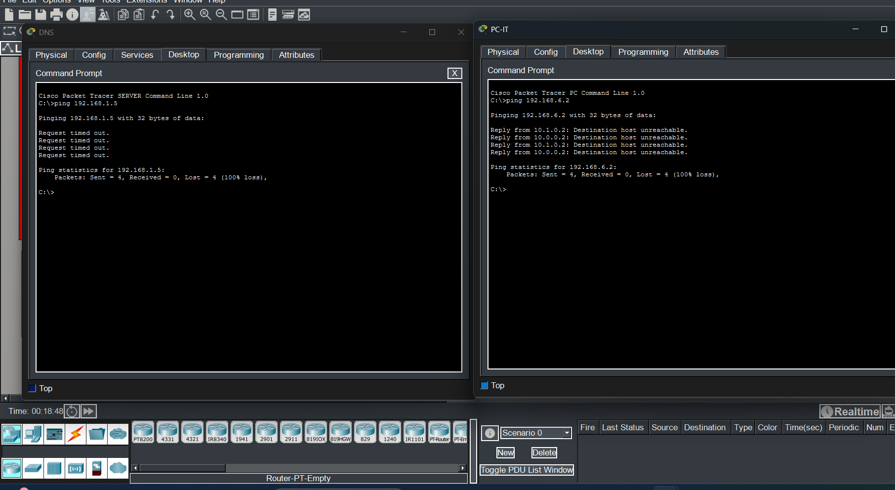
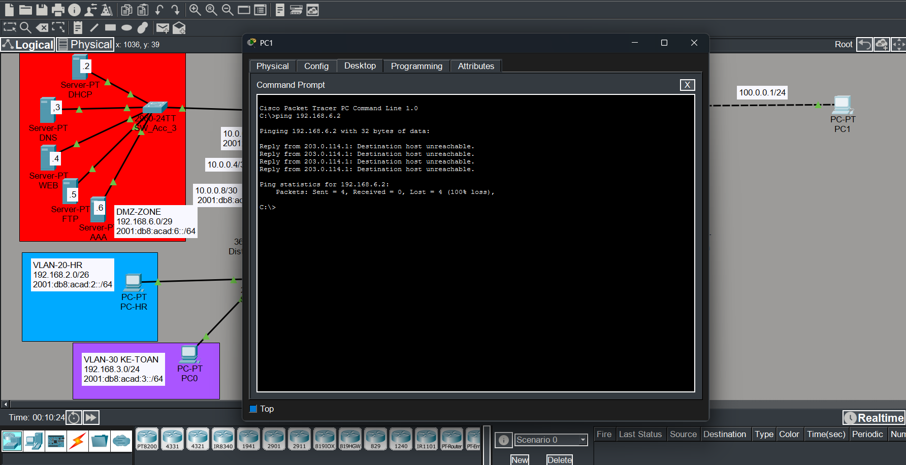

### 🔒 Management Access Control (SSH)

Remote management access is strictly controlled using SSH and ACLs.

- Only devices in the **IT department (VLAN 10 – PC-IT)** are permitted to access
  the Distribution switches via SSH for configuration and management.
- Guest users (**GUEST1 and GUEST2 – VLAN 40 / VLAN 50**) and other departments
  are explicitly denied SSH access.
- SSH authentication is enforced using local user credentials.

This ensures that only authorized IT administrators can manage network devices.

---

### 🚫 Guest Network Access Restrictions

Wireless guest networks are isolated from internal departments:

- **GUEST1 (WPA2-Personal, VLAN 40)** and **GUEST2 (WPA2-Enterprise, VLAN 50)**
  are denied access to internal departmental VLANs.
- Guest users are allowed only basic network services as defined by policy.
- Inter-VLAN access from guest networks to internal users is blocked by ACLs.

This design protects internal resources while still providing guest connectivity.

---

### 🔁 DMZ ↔ LAN Traffic Filtering (Router_DMZ)

Traffic between the DMZ and internal LAN is filtered using extended ACLs
configured on the DMZ router:

- Internal users are allowed to access specific DMZ services
  (DHCP, DNS, HTTP) only.
- Unauthorized traffic from the DMZ toward the internal LAN is denied.
- All permitted traffic is explicitly defined, following the principle
  of least privilege.
  

This ensures secure communication between internal users and DMZ servers.

---

### 🌍 Internet ↔ Internal Traffic Control (ABR)

The ABR router enforces security policies for traffic entering and leaving
the enterprise network:

- Outbound traffic from internal networks to the Internet is permitted
  according to defined NAT and ACL rules.
- Inbound traffic from the Internet is restricted and only allowed to
  reach approved DMZ services.
- Direct Internet access to internal LAN networks is blocked.

This provides a secure boundary between the enterprise network and external
networks.

---

These verification results confirm that management access, guest isolation,
DMZ protection, and Internet traffic control are implemented in accordance
with enterprise security best practices.
